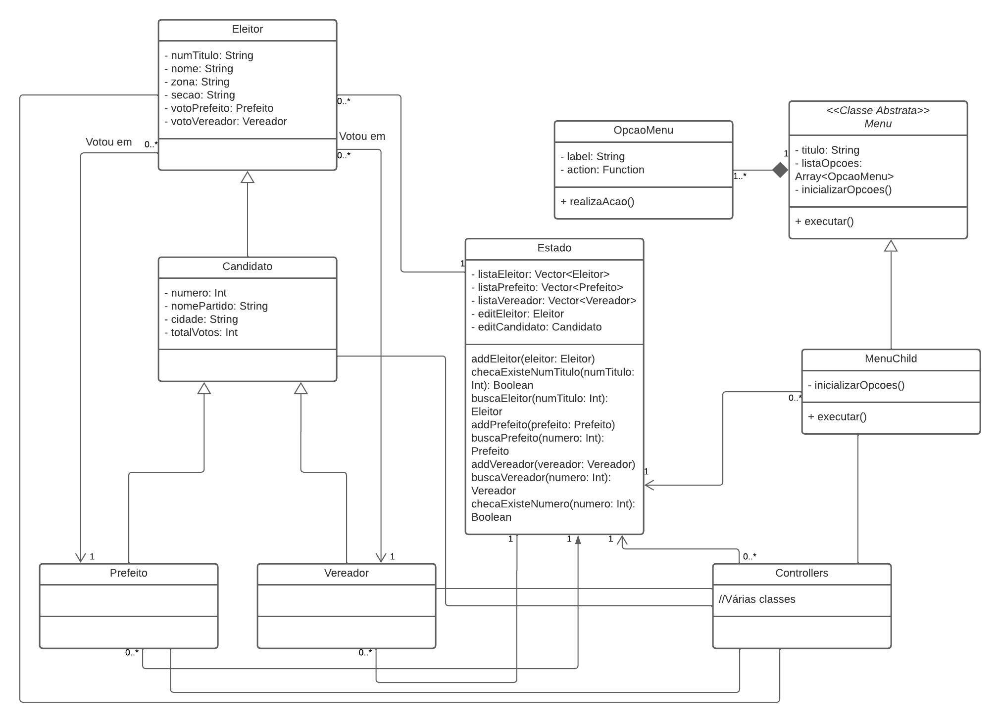

# TP2
Trabalho Prático 2 de INF112, por João Vitor De Melo Machado.
## Como Instalar e Executar
- Instale o CMake
> sudo apt-get -y install cmake
- Na pasta do projeto, realize o build
> cmake build
- Execute o arquivo executável
> ./build/tp2
## Diagrama UML

